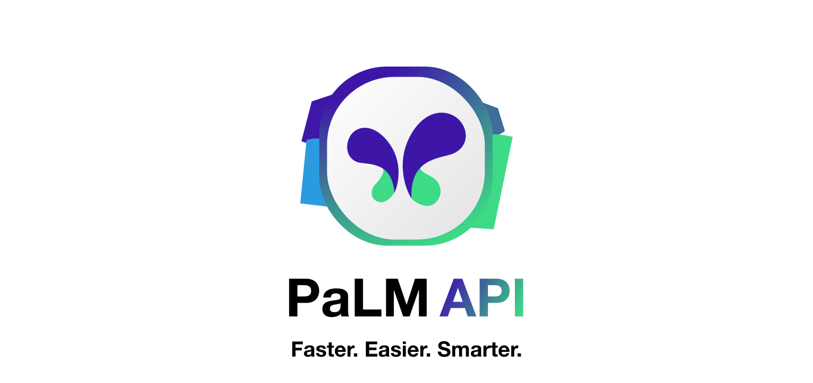

<picture>

  <source media="(prefers-color-scheme: dark)" srcset="./assets/banner@dark.svg">
  <source media="(prefers-color-scheme: light)" srcset="./assets/banner@light.svg">
  
</picture>

# PaLM API

The most powerful JavaScript Google PaLM API available.

## Features

- 🤖 **Multi-Model Support**: Use any model available for PaLM
- 🌐 **Contextual Conversations**: Chat with PaLM with ease
- 🧪 **Easy Parameter Tweaking**: Easily modify `temperature`, `top_p`, and more

### Highlights

Compared to Google's [own API](#why-palm-api):
- ⚡ **Fast**: _**n**_ times faster
- 🚀 **Easy**: _**2.8x**_ less code needed
- 🪶 **Lightweight**: _**260x**_ smaller minzipped size

## Table of Contents
- [Why PaLM API?](#why-palm-api)
- [Documentation](#documentation)
	- [Setup](#setup): Getting Started
	- [`PaLM.ask()`](#palmask): The best way to use PaLM
	- [`PaLM.generateText()`](#palmgeneratetext): Use `generateText` models
	- [`PaLM.embed()`](#palmembed): Embed text with PaLM
	- [`PaLM.createChat()`](#palmcreatechat): Continue conversations easily.

## Why PaLM API?

Google has its own API interface for PaLM, though their [@google/generativelanguage](https://www.npmjs.com/package/@google-ai/generativelanguage) and [google-auth-library](https://www.npmjs.com/package/google-auth-library) packages	.

However, making requests with the native package is simply too complicated, clunky, and slow.

Here's the code you need for the Google API to ask PaLM something with context:

```javascript
const { DiscussServiceClient } = require("@google-ai/generativelanguage");
const { GoogleAuth } = require("google-auth-library");

const client = new DiscussServiceClient({
	authClient: new GoogleAuth().fromAPIKey(process.env.API_KEY),
});

const result = await client.generateMessage({
	model: "models/chat-bison-001",
	prompt: {
		context: "Respond to all questions with a single number.",
		messages: [{ content: "How tall is the Eiffel Tower?" }],
	},
});

console.log(result[0].candidates[0].content);
```

And here's the equivalent code in `palm-api`:

```javascript
import PaLM from "palm-api";

let bot = new PaLM(process.env.API_KEY);

bot.ask("How tall is the Eiffel Tower?", {
	context: "Respond to all questions with a single number.",
});
```

Yep! That's it... get the best features of PaLM, in a package that's simpler and easier to use, test, and maintain.

## Documentation

### Setup

Import PaLM API, then initialize the class with your API key.

> **Warning**
> It is recommended that you access your API from `process.env` or `.env`

```javascript
import PaLM from "palm-api";

let bot = new PaLM(API_KEY, { ...config });
```

#### Config

| Config | Type     | Description                                                    |
| ------ | -------- | -------------------------------------------------------------- |
| fetch  | function | Fetch polyfill with _same interface as native fetch_. Optional |

> **Info**
> PaLM itself and all of its methods have a `config` object that you can pass in as a secondary parameter.
> Example:
>
> ```javascript
> import fetch from "node-fetch";
> let bot = new PaLM(API_KEY, {
> 	fetch: fetch,
> });
> ```

### `PaLM.ask()`

Uses the `generateMessage` capable models to provide a high-quality LLM experience, with context, examples, and more.

**Models available:** `chat-bison-001`

#### Usage:

```javascript
PaLM.ask(message, { ...config });
```

#### Config:

| Config            | Type                                       | Description                                                        |
| ----------------- | ------------------------------------------ | ------------------------------------------------------------------ |
| `model`           | string                                     | Any model capable of `generateMessage`. Default: `chat-bison-001`. |
| `candidate_count` | integer                                    | How many responses to generate. Default: `1`                       |
| `temperature`     | float                                      | Temperature of model. Default: `0.7`                               |
| `top_p`           | float                                      | top_p of model. Default: `0.95`                                    |
| `top_k`           | float                                      | top_k of model. Default: `40`                                      |
| `format`          | `PaLM.FORMATS.MD` or `PaLM.FORMATS.JSON`   | Return as JSON or Markdown. Default: `PaLM.FORMATS.MD`             |
| `context`         | string                                     | Add context to your query. Optional                                |
| `examples`        | array of `[example_input, example_output]` | Show PaLM how to respond. See examples below. Optional.            |

#### Example:

```javascript
import PaLM from "palm-api";

let bot = new PaLM(API_KEY);

bot.ask("x^2+2x+1", {
	temperature: 0.5,
	candidateCount: 1,
	context: "Simplify the expression",
	examples: [
		["x^2-4", "(x-2)(x+2)"],
		["2x+2", "2(x+1)"],
		// ... etc
	],
});
```

#### JSON Response:

```javascript
[
	{ content: string }, // Your message
	{ content: string }, // AI response
	// And so on in such pairs...
];
```

### `PaLM.generateText()`

Uses the `generateText` capable models to let PaLM generate text.

**Models available:** `text-bison-001`

#### API:

```javascript
PaLM.generateText(message, { ...config });
```

#### Config:

| Config            | Type                                     | Description                                                     |
| ----------------- | ---------------------------------------- | --------------------------------------------------------------- | --- |
| `model`           | string                                   | Any model capable of `generateText`. Default: `text-bison-001`. |
| `candidate_count` | integer                                  | How many responses to generate. Default: `1`                    |
| `temperature`     | float                                    | Temperature of model. Default: `0`                              |
| `top_p`           | float                                    | top_p of model. Default: `0.95`                                 |
| `top_k`           | float                                    | top_k of model. Default: `40`                                   |
| `format`          | `PaLM.FORMATS.MD` or `PaLM.FORMATS.JSON` | Return as JSON or Markdown. Default: `PaLM.FORMATS.MD`          |     |

#### Example:

```javascript
import PaLM from "palm-api";

let bot = new PaLM(API_KEY);

bot.generateText("Write a poem on puppies.", {
	temperature: 0.5,
	candidateCount: 1,
});
```

#### JSON Response:

```javascript
[
	{
		output: output,
	},
];
```

### `PaLM.embed()`

Uses PaLM to embed your text into a float matrix with `embedText` enabled models, that you can use for various complex tasks.

**Models available:** `embedding-gecko-001`

#### Usage:

```javascript
PaLM.embed(message, { ...config });
```

#### Config:

| Config  | Type   | Description                                                          |
| ------- | ------ | -------------------------------------------------------------------- |
| `model` | string | Any model capable of `generateText`. Default: `embedding-gecko-001`. |

#### Example:

```javascript
import PaLM from "palm-api";

let bot = new PaLM(API_KEY);

bot.embed("Hello, world!", {
	model: "embedding-gecko-001",
});
```

#### JSON Response:

```javascript
[...embeddingMatrix];
```

### `PaLM.createChat()`

Uses `generateMessage` capable models to create a chat interface that's simple, fast, and easy to use.

### Usage:

```javascript
let chat = PaLM.createChat({ ...config });

chat.ask(message, { ...config });

chat.export();
```

The `ask` method on Chat remembers previous messages and responses, so you can have a continued conversation.

Basic steps to use import/export chats:

1. Create an instance of Chat with `PaLM.createChat()`
2. Use `Chat.ask()` to query PaLM
3. Use `Chat.export()` to export your messsages and PaLM responses
4. Import your messages with the messages config with `PaLM.createChat({messages: exportedMessages})`

> **Info**
> You can actually change the messages exported, and PaLM in your new chat instance will adapt to the "edited history." Use this to your advantage!

#### Config for `createChat()`:

All configuration associated with `Chat.ask()` _except_ the `format` is set in the config for `createChat()`.

| Config            | Type                                       | Description                                                        |
| ----------------- | ------------------------------------------ | ------------------------------------------------------------------ |
| `messages`        | array                                      | Exported messages from previous Chats. Optional.                   |
| `model`           | string                                     | Any model capable of `generateMessage`. Default: `chat-bison-001`. |
| `candidate_count` | integer                                    | How many responses to generate. Default: `1`                       |
| `temperature`     | float                                      | Temperature of model. Default: `0.7`                               |
| `top_p`           | float                                      | top_p of model. Default: `0.95`                                    |
| `top_k`           | float                                      | top_k of model. Default: `40`                                      |
| `context`         | string                                     | Add context to your query. Optional                                |
| `examples`        | array of `[example_input, example_output]` | Show PaLM how to respond. See examples below. Optional.            |

#### Config for `Chat.ask()`:

| Config   | Type                                     | Description                                            |
| -------- | ---------------------------------------- | ------------------------------------------------------ |
| `format` | `PaLM.FORMATS.MD` or `PaLM.FORMATS.JSON` | Return as JSON or Markdown. Default: `PaLM.FORMATS.MD` |

#### Example:

```javascript
import PaLM from "palm-api";

let bot = new PaLM(API_KEY);

let chat = PaLM.createChat({
	temperature: 0,
	context: "Respond like Shakespeare",
});

chat.ask("What is 1+1?");
chat.ask("What do you get if you add 1 to that?");
```

The response for `Chat.ask()` is exactly the same as `PaLM.ask()`. In fact,they use the same query function under-the-hood.
